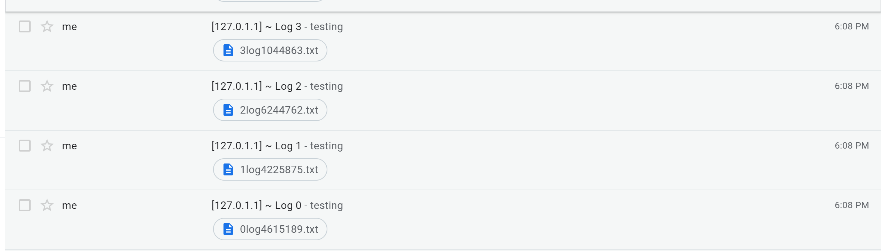
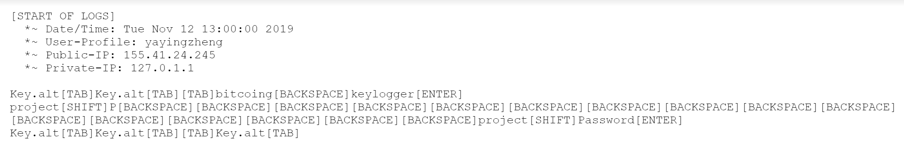

# Background
## High-level Description
We are group 2, consisting of Cindy Bai, Diana Deleon, Jennifer Norell, Yaying Zheng, and Lavi Zhao. Our project is a security assessment of Bitcoin and the platforms used to buy and sell Bitcoin. We looked into various ways to attack bitcoin and implemented wallet theft attack. What will be seen in our current report is a type of attack called wallet theft on two seperate bitcoin wallets. We explored a second type of attack, double spending attack. Below we will discuss the other attacks we considered and ultimately did not recreate.

## References
IEEE Communications Surveys and Tutorials, May 2018, A Survey on Security and Privacy Issues of Bitcoin by Mauro Conti and Others (https://ieeexplore.ieee.org/document/8369416)
- This paper presented a systematic review of the security and privacy of Bitcoin through the analysis of existing vulnerabilities and its underlying technologies such as blockchain and PoW-based consensus protocol.

Cornell University arXiv, April 2019, Exploring the Attack Surface of Blockchain: A Systematic Overview by Muhammad Saad and Others (https://arxiv.org/abs/1904.03487)
- This paper explored the attack surface of Blockchain technology in the context of Blockchain cryptographic constructs, the distributed architecture of the systems using Blockchains, and Blockchain application. To analyze the said factors, the paper outlined attacks such as selfish mining, 51% attack, Domain Name System (DNS) attacks, distributed denial-of-server (DDoS) attacks, Blockchain forks, wallet thefts, and etc.

ACM Conference on Computer and Communications Security, October 2012, Two Bitcoins at the Price of One? Double-Spending Attacks on Fast Payments in Bitcoin by Ghassan O. Karame, Elli Androulaki, and Srdjan Capkun (https://www.researchgate.net/publication/262315254_Double-spending_fast_payments_in_Bitcoin)
- This paper focused on double spending attacks in Bitcoin fast payments, which is when the time between exchanges is small (i.e. in the order of seconds). It also highlighted how countermeasures suggested by Bitcoin developers are not always effective in defending against double spending attacks.

24th USENIX Security Symposium, Eclipse Attacks on Bitcoin’s Peer-to-Peer Network by Ethan Heilman, Alison Kendler and Sharon Goldberg, Boston University; Aviv Zohar, The Hebrew University of Jerusalem and MSR Israel (https://www.usenix.org/node/190891)
- This paper presented eclipse attacks on Bitcoin’s Peer-to-Peer network. The attack implemented allowed attackers to gain access to incoming connections at the victim’s node in order to use N-confirmation double spending, selfish mining, and adversarial forks in the blockchain.

## Technical Content
In terms of technical content, we implemented one of the four categories of attacks mentioned. We evaluated the 51% attack and the DDoS attack, but due to its high demand for computing power, the assessment of these attacks are purely theoretical. The remaining two attacks are the wallet theft attack and the double spending attack. We did not complete the double spending attack because we simply underestimated the amount of time it would take to implement. However, it will be completed for the final report. The wallet theft attack was successfully implemented. We chose to attack two specific wallets using both a UIJacking website and a keylogger to steal usernames and passwords for each one.  

The keylogger was implemented in Python. It records the keystrokes of the target in a log. The log is then emailed to a gmail account we created every 10 minutes. To distribute the keylogger, we can attach the executable to a carefully crafted email using social engineering tactics. For example, we can get BU Trustee signature and/or impersonate IT Help Center to distribute a patch.
The keylogger should be targeting at selected users due to the extensive nature of keylogging. High-value users can be selected through social engineering tactic. We can also hide the executable in other unsuspicious formats or distribute a trojan to download and run the keylogger.

For the website, we can spread the link to email addresses from public directories and/or put the website on Google. For example, the BU directory and many other college directories are public. We can also use crawlers to scan the web for the @ sign and email extractors to harvest emails.

We recreated fake login pages for two Bitcoin wallet (Coinbase and Blockchain) so that all links works the same as the real login page except for the login button. Once the user fill out their account information, these information will be send to our node servers. For demonstration purposes, and to avoid both legal repercussions and other people from accessing these sites, we are using localhost inside both the html file and the backend server. In reality, the destination for the form will not be localhost but rather be another ip address where the server is hosted.

### Some More Attacks: 51% Attacks
###### What is it?
51% attack is an attack on a blockchain, a chain of blocks containing data, where the attacker ends up controlling more than 50% of the network's computing power. The attacker would be able to prevent new transactions from gaining confirmations which allows them to collect block rewards and cause other miners to have invalid blocks. They would also be able to reverse transactions that were completed while they were in control of the network, meaning they could double-spend coins. However, they would not be able to create new coins or alter old blocks.

For bitcoin, a new block is generated approximately every 10 minutes where all completed transactions are recorded during a given period of time. Once a block is finalized, it cannot be altered, since a fraudulent version of the public ledger would quickly be spotted and rejected by the network's users. However, by controlling the majority of the computing power on the network, an attacker can interfere with the process of recording new blocks. They can prevent other miners from completing blocks which allows them to monopolize the mining of new blocks and earn the rewards.

###### Why we cannot implement
51% Attack is too difficult to implement because we would need to create a decent sized bitcoin blockchain from scratch. This process would typically takes weeks to complete, so we wouldn’t have enough time to finish our blockchain. However, if we did have enough time, our blockchain use-case would focus on data authentication and verification which includes immutable storage, digital signatures and data encryption. Smart asset management would also be focused on, since it includes payment and exchange. Then, we would use Proof of Work as a consensus mechanism, since it already powers the bitcoin crypto-currency blockchain. The PoW is an algorithm used to confirm transactions and produce new blocks to the chain. This algorithm would’ve been used on the Ethereum blockchain platform, since it’s compatible with this platform. Next, we’d make our blockchain solutions permission-less, since anyone can become a miner. Another factor to consider at this stage is whether the nodes will run on the cloud, on-premise or both. We’d probably have it run on-premise, since we don’t want our blockchain on the cloud for everyone to access. Then, we’d decide about hardware configuration issues like processors, memory and disk size. Then, we’d need to decide on the base operating systems which include Ubuntu, CentOS, Debian, Fedora, Red Hat or Windows. Once we decide on those factors, we then need to decide on the platform’s configuration for the following elements: Permissions, Asset issuance, Asset re-issuance, Atomic exchanges, Key management, Multi signatures, Parameters, Native assets, Address formats, Key formats, Block signatures and Hand-shaking. Then, we’d have to look into the major categories of APIs that we would need which include: Generating key pairs and addresses, Performing audit related functions, Data authentication through digital signatures and hashes, Data storage and retrieval, and Smart-asset lifecycle management. Lastly, we’d focus on the UI and connecting backend to frontend. This proves to be too big of a project.

To initiate a 51% attack, we need to “fork” the blockchain, which means splitting it in two. Then we need to convince the network that our malicious forked blockchain is the real one. Cryptocurrencies need to have a way of knowing which blockchain is the ‘real’ one, so the longest chain usually wins. Then, we keep our fork either secret to one computer, or let it go between the nodes we control. Once we have our fork, we need to keep it up to date with the rest of the network. Then, we essentially create a mirror image of the original blockchain. We can then do something on the live blockchain and not copy it into our secret one. Then, we can mine a bit harder on our secret blockchain and have it be a little longer than the real one. Nodes in a cryptocurrency network always follow the longest chain, since it indicates what the network at large wants to do. Once we release our secret blockchain to the network, all the nodes grab it and see it as the real one because it is now the longest. Once our blockchain is seen as the real one, whatever we did before is undone. To double spend, we can pay for something and then switch out the old blockchain with our secret one where the cryptocurrency is instead transferred to a different address.

### Some More Attacks: Double Spending Attacks

Double-spending is a potential flaw in a digital cash scheme in which the same single digital token can be spent more than once. Bitcoin uses a confirmation mechanism and a public ledger to solve the double spending problems. If two transactions are generated for the same amount of bitcoin, only one of these transactions will be validated if they are pulled from the pool of unconfirmed transactions at different time. The miners will determine the first transaction to get verified and get six confirmations(six subsequent blocks of transactions) to be valid and discard the second transaction.  
We attempted double spending attack with existing open source double spending tools and Blockchain. These tools essentially create a race condition without waiting for confirmations. Below is a video demo of the double spending tool:  
  
Double spending tools we tried:  
http://doublespend.me/  
https://doublespend.online/  

## Limitations
Most of the network attack and system attack are only evaluated and not implemented.

Regarding Coinbase, a 2-factor verification is required for the login process. From our research, there are ways of intercepting texts from target users. However, we did not attack the 2-factor verification and instead focused on the first level of verification only.

Another limitation for the UI-jacking / tabnabbing in general is that nowadays people use the browser’s “remember my password” and auto-filling function a lot. Especially, since the the wallet ID used by Blockchain is really long and complicated, it is very unlikely that the user will remember and type in the id manually. If the user see that the login information is not being auto-filled, they will probably realize that this is not the real login site.

As we were implementing the keylogger, we discovered that the python library `pynput` and python tool `pyinstaller` was only compatible for Linux. As such, we were unable to run the python executable created using `pyinstaller` on a Windows or macOS machine.

Due to the limitation on time and resources, we were not able to actually implement the 51% attack and the DDoS attack. We started on implementing the double spending attack, but we weren't able to finish it by the time this report is due. However, we will be able to have it done for the updated final report.

## Results
We were able to get user login credentials from both the keylogger and the UI-jacking implementation. The results from the UI-Jacking websites are displayed on the console log of the host, and for the coinbase UIjacking website, they are also saved to a text file.

# Material
## Compilation Instruction
#### For both Blockchain and Coinbase, install node.js, npm, and express:
(If already installed, please move on)

Inside the terminal:
- `Sudo apt install nodejs`
- `Sudo apt install npm`
- `Sudo npm install express`

#### For Blockchain Demo
Inside the terminal:
- `cd Blockchain/`
- `node myserver.js`
- Leave the terminal open and go to a browser, and go to: http://localhost:8080/
- The loading page will appear. The page will refresh after 10 seconds to the impersonated login page of Blockchain. Once you enter your login information and hit submit, the login information will be printed onto the terminal where the server is running.

#### For Coinbase Demo
Inside of terminal
- Locate folder of Coinbase (cd coinbase)
- `node main`
- leave terminal running and open browser
- go to http://localhost:3000/ and wait for loading page to disappear
- enter email and password
- return to terminal to view credentials
- go back into folder of coinbase and open the `log.txt` file to view credentials

#### For Keylogger
Before moving on to keylogger setup, make sure you have the following installed in the exact order:
- Python 3
    - If you do not have Python 3, go to https://www.python.org/downloads/ to install.
- `pip3`
    - If you do not have `pip3` installed, follow the instructions below to do so:
        * `sudo apt-get update`
        * `sudo apt-get install python3-pip`
- pynput
    - If you do not have `pynput`, install using `pip3 install pynput`
- pyinstaller
    - If you do not have `pyinstaller`, install using `pip3 install pyinstaller`
    - If you do have `pyinstaller`, first uninstall using `pip3 install pyinstaller` and then follow the instruction above to install it again.

Setting up keylogger
- Before running the keylogger, you must create an email account (preferably gmail) where the logs will be sent. Once the email is created, you have to allow for less secure apps to access the account otherwise sending email via SMTP will not work. Go to https://devanswers.co/allow-less-secure-apps-access-gmail-account/ to see how to allow for such access.
- Once that is done, you have modify the `config.py` to your email address and password
    - `cd keylogger`
    - Open `config.py` with editor and modify email address and password
    - Save

Test the keylogger
- Convert `python_keylogger.py` into an executable using `pyinstaller --onefile -w python_keylogger.py`
- You should see `dist` and `build` directory created.
- Move the file in the `dist` directory into your current directory
- Then run `./python_keylogger`
- Leave terminal running and proceed to doing your task. You should see an email sent to gmail specified in `config.py` every 10 minutes.

    
    

Modify the keylogger
- Open the `python_keylogger.py` in an editor and make the changes
- Delete the `python_keylogger` exectuable file if it exists
- Follow the "Test the keylogger" section to run the keylogger

Injecting the keylogger onto victim's computer
- Using social engineering (e.g. UI-Jacking or attaching the executable to an image or link), we can get the user to execute the keylogger on their computer. Once that occurs, we will be able to obtain logs from their computer in order to get their keys and login information.

## Security Assessment
#### For Keylogger
Through social engineering, we can potentially get a user to download a keylogger onto their machine. These keyloggers can be hidden in html forms, images, and other executables. If we are able to successfully get a user to download the keylogger, we can access the user's key strokes by having the keylogger send the logs to an email or post it on a webserver. From the logs, we can determine the login information for different services, e.g. bitcoin wallets such as Coinbase and Blockchain.  

#### For UI-Jacking / Tabnabbing
One vulnerability was found when we tried to recreate the fake login page for Coinbase. By using F12 and then going to the network tab, we were able to find the source code of the page so that we can just copy the html code without having to recreate the site from scratch. We tried to do the same thing for Blockchain but they were doing a good job of keeping their source code hidden, so we actually had to recreate the site ourselves. At the end, for both Coinbase and Blockchain, we were able to successfully get user's login information send to our back end server.

# Signed Statement
- Cindy Bai
    - I worked UIJacking for the bitcoin wallet named Blockchain. I first examined the source code the the actual login page at https://login.blockchain.com/#/login. Since I will not be able to just copy over the source code, I started to recreate the login page from scratch. I then set up a server where I host my html files and also will print the received login information to the terminal. I then added another fake loading page and designed so that it will automatically refresh to the impersonated login page after 10 seconds.
- Diana DeLeón
    - I looked into email phishing, and UIJacking for Coinbase. I attempted to set up a Firebase database in order to store the Coinbase email and passwords. I worked on tabnabbing by copying the source code and then having user input sent to a file.
    - For the Final update, I also wrote the Technical Content on 51% attack.
- Jennifer Norell
    - I worked on the UIJacking website for Coinbase. Specifically I found the html we are using to copy Coinbase’s sign-in page and sent the information to both a text file and a page on the server. I also implemented a timer to load a faking loading page which would then redirect to the fake UI.
- Lavi Zhao
    - I worked on implementing a python keylogger with email sending capabilities. I looked into setting up Bitcoin Lite node implementing trojans that downloads malicious files onto target’s machine. I did research on system and network attacks on Bitcoin, specifically 51% attack and double spending attack. I attempted various open source double spenders.
- Yaying Zheng
    - I worked on the python keylogger using the `pynput` python library, which logged the user's key strokes in order to steal private keys and login information. I first looked into using a third party keylogger software, however I realized that I would need a way to access the logs once the victim downloads the keylogger. As such, something like an email would be need to attached to the keylogger executable. However, many third party keyloggers does not have this option. As I looked at references online, I saw that many people used the `pynput` library in python to write their own python keylogger. Therefore, I decided to constructed my own python keylogger. This keylogger would log the user's keystrokes and send them to a designated email using SMTP. I also look into posting this information onto a webserver using HTTP Post and PHP. However, I was unable to successfully post the log file. As I proceeded with the email method using SMTP, I encountered some issues with sending an email to the specified gmail account. This was because gmail does not allow less secure apps to access the account. In order to get SMTP working, I had to disable this feature. Once I finished the python keylogger, I needed a way to get it onto the victim's computer. My thought process was to compile all the python scripts into one executable and attach it to an image or html form. However, due to time constraints, I was only able to finish the first part, which was compiling all the python files into one executable.
